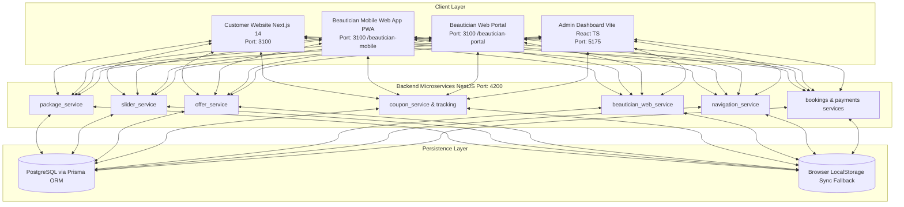

# BEAUTY NEST - MASTER SYSTEM DOCUMENTATION & ARCHITECTURAL REFERENCE MANUAL
**Complete Platform Guide: Customer Website, Beautician Portals, Admin Control Suite, Backend APIs, and Customization Handbook**

---

## 1. Executive Summary & Vision

**Beauty Nest** is an enterprise-grade, on-demand doorstep salon and wellness platform crafted exclusively for women. The platform connects certified female beauty professionals with customers in tier-1 and tier-2 Indian cities (spearheaded in **Varanasi**, along with Lucknow, Prayagraj, Ayodhya, Kanpur, Gorakhpur, and Noida).

### Core Pillars
1. **100% Female-Centric & Safe**: Only certified, background-verified female beauticians serving female clients at their homes.
2. **Medical-Grade Hygiene**: Single-use sealed kits, PPE, sanitized tools, and mandatory digital health & allergy pre-service consent.
3. **Transparent Dynamic Pricing**: Multi-component transparent tariff formula breaking down Labor, Beautician Commission, Cosmetic Product portion, Distance Allowance, and Safety Kit.
4. **End-to-End Navigation & Realtime Tracking**: Seamless doorstep dispatch, live GPS simulator, interactive route mapping, and turn-by-turn guidance.
5. **Complete Admin Command**: Total self-service control over services, categories, pricing formulas, packages, slider imagery, promo codes, festival offers, and cities.

---

## 2. Technical Architecture & Repository Blueprint

### Tech Stack Summary
- **Backend API**: NestJS 10, TypeScript, Prisma ORM, PostgreSQL, Passport JWT, Swagger Documentation.
- **Customer Web & Mobile PWA**: Next.js 14 (App Router), React 18, Tailwind CSS, Lucide Icons, HTML5 Geolocation, Canvas Vector Mapping.
- **Admin Management Dashboard**: React 18, Vite, TypeScript, Tailwind CSS, LocalStorage Sync, Lucide Icons.

---

## 3. Customer Website & Booking Experience

### A. Homepage & Rotating Luxury Hero Slider
- **Location**: `customer-website/components/Hero.tsx`
- **Features**:
  - Auto-rotates every 4.5 seconds with pause-on-hover.
  - Interactive Left/Right navigation arrows and dot indicator buttons.
  - Floating trust pills: `★ 4.9 (11,500+ Reviews)`, `Salon at Home 🌸`.
  - Handwritten script overlays: *Glow Like Never Before ✨*, *Royal Bridal Rituals 🌸*, *Pure Glass Skin 💧*.
  - Configurable via Admin Slider Manager (`/slider/slide1.png`, `/slider/slide2.png`, `/slider/slide3.png` or uploaded files).

### B. Varanasi Location Hub Selector & GPS Simulator
- **Location**: `customer-website/components/BookingModal.tsx` & `Navbar.tsx`
- **12 Varanasi Service Hubs**: Sigra, Lanka, Assi Ghat, Bhelupur, Godowlia, Cantt, Shivpur, Durgakund, Mahmoorganj, Orderly Bazaar, Sarnath, Pandeypur.
- **One-Click GPS Auto-Detect**:
  - Simulates satellite GPS lock (`25.3176° N, 82.9739° E`) with a 0.8s pulsing radar animation.
  - Automatically selects nearest salon hub, fills coordinates, and computes distance.
- **Interactive Visual Map Canvas**:
  - Displays the holy Ganga river curve, Sigra central salon dispatch center, destination delivery pin, and an animated travel route.
- **Distance Fee Calculation**:
  - Distance $\le 3\text{ KM}$: **100% FREE** travel allowance.
  - Distance $> 3\text{ KM}$: First 3 KM free, then ₹50/KM added to doorstep bill.

### C. Digital Health & Allergy Consent Form (Step 4)
- **Mandatory Pre-Service Declaration**:
  - Allergy checkboxes: Ammonia, Bleach, Wax, Resin, None.
  - Skin Sensitivity: Normal, Sensitive, Ultra Sensitive.
  - Health Profile: Pregnancy / Nursing check, open cuts or sunburn check.
  - Digital authorization archiving for beautician verification before procedure starts.

### D. Multi-Component Dynamic Pricing Formula (Step 5)
$$\mathbf{Final\ Bill} = \text{Base Labor} + \text{Beautician Cut} + \text{Cosmetic Cost} + \text{Distance Fee} + \text{Safety Kit} - \text{Coupons} + \text{GST}$$

- **Cosmetic Product Cost Waiver**:
  - Checkbox: *"I have my own cosmetic products"* $\rightarrow$ waives cosmetic fee to **₹0**!
- **Dynamic Coupon Engine**:
  - Auto-validates active coupon codes against minimum order thresholds.
  - Instant discount deduction with one-click promo chips (`VARANASI50`, `GLOW30`, `BRIDAL1000`, `FESTIVE25`, `WELCOME200`) and a "Remove" button.

---

## 4. Beautician Portals & Mobile Web App PWA

### A. Beautician Mobile Web App PWA
- **Live URL**: `http://localhost:3100/beautician-mobile`
- **Format**: Native mobile application style responsive PWA with bottom navigation (`Home`, `Orders`, `Navigation`, `Earnings`).
- **Beautician Login**:
  - Mobile Number verification (`9876543210`).
  - 4-digit OTP login (Demo code: `1234`).
- **Dashboard View**:
  - Today's Bookings count, Upcoming Services, Completed Services.
  - Today's Earnings card (`₹4,850 Today` / `₹38,400 Month`).
  - Online / Offline availability toggle.
  - Notifications drawer for new assignments and bonuses.

### B. Beautician Service Order Module
- **Order Card**:
  - Order Number (e.g. `#BK-69006`)
  - Customer Name (`Pooja Sharma`) & Verified Phone (`+91 98765 43210`)
  - Service Name (`O3+ Bridal Glow Facial`)
  - Booking Date & Time (`Today, 03:30 PM`)
  - Customer Location & Landmark
  - Distance from salon hub (`2.4 KM`)
  - Payout / Commission amount (`₹570`)
- **Actions**:
  - **Accept**: Moves booking to Active transit.
  - **Reject**: Declines with reason and returns to queue.
  - **Navigate**: Launches "Go To Customer" live tracking.

### C. Customer Location Navigation ("Go To Customer")
- Displays when Beautician initiates travel:
  - **Current Location**: Sigra Salon Dispatch Center (`25.3176° N, 82.9739° E`).
  - **Customer Destination**: Anand Nagar Colony, Assi Ghat Crossing.
  - **Live Distance & ETA**: `2.4 KM` $\rightarrow$ `14 Mins remaining`.
  - **Vector Map Canvas**: Interactive route diagram with waypoint polyline.
  - **Persistent Customer Address**: Customer address, phone, direct call button, and Google Maps external link remain anchored throughout transit.
  - **Production Ready**: Abstracted architecture ready for Google Maps SDK and Directions API replacement.

### D. The 8-Step Service Flow Engine
$$\text{Login} \rightarrow \text{New Order} \rightarrow \text{Accept Order} \rightarrow \text{View Customer Location} \rightarrow \text{Navigate} \rightarrow \text{Reach Customer} \rightarrow \text{Start Service} \rightarrow \text{Complete Service}$$

1. **Login**: Phone + OTP authentication.
2. **New Order**: Notification card with service, location, and payout.
3. **Accept Order**: Beautician confirms availability.
4. **View Customer Location**: Reviews exact flat number, colony, and landmark.
5. **Navigate**: "Go To Customer" vector map directions.
6. **Reach Customer**: Clicks *"I Have Reached Customer Doorstep"*.
7. **Start Service**: Enters customer's 4-digit start OTP (Demo: `1234`) to commence treatment.
8. **Complete Service**: Clicks *"Finish Service"*, bill finalized, and commission credited to Beautician Wallet.

---

## 5. Admin Dashboard Control Suite

**Live URL**: `http://localhost:5175`

### 1. Package Builder Module (`CATALOG -> Package Builder`)
- **Create, Edit, Delete, Activate/Deactivate** custom bundles.
- **Fields**: Package Name, Image Uploader, Description, Selected Services, Original Price, Custom Selling Price, Discount %, Validity (e.g. 365 Days).
- **Auto-Calculation**: `Package Base Price = Sum of selected service prices`.
- Admin can manually adjust the final selling price to provide tailored promotional discounts.

### 2. Home Slider Management (`OPERATIONS -> Hero Sliders`)
- **Add, Edit, Delete Banners, Change Priority** (Move Up / Down).
- **Device Image Uploader**: Allows uploading photos directly from computer/phone (converted to Base64) or entering custom URLs.
- **Fields**: Banner Image, Title, Description, Button Text, Redirect Page, Status (`ACTIVE` / `INACTIVE`).
- Real-time mobile & desktop simulator preview.

### 3. Offer Management Module (`CATALOG -> Offer Management`)
- **4 Offer Types**:
  1. `Service Offers`: Specific catalog beauty treatments.
  2. `Package Offers`: Discounted combo rituals.
  3. `Festival Offers`: Diwali, Dev Deepawali, Eid, Karwa Chauth rituals.
  4. `Seasonal Offers`: Winter skin hydration, Summer de-tan rituals.
- **Fields**: Offer Name, Offer Type, Discount Type (`FIXED` / `PERCENTAGE`), Discount Value, Applicable Services/Packages, Start Date, End Date, Status.

### 4. Coupon Code Management & Analytics (`OPERATIONS -> Coupons & Promos`)
- **Configurable Rules**: Fixed or Percentage discount, Minimum booking value, Maximum total usage limit, Per-user limit, Expiry date, Service/Category restrictions.
- **Coupon Analytics Dashboard**:
  - `Total Coupons Created`
  - `Total Used`
  - `Remaining Usage`
  - `Revenue Generated`
- **CouponUsageHistory**: Detailed audit trail of each customer redemption with customer name, phone, booking ID, order value, discount given, and timestamp.

### 5. Taxonomy & Services Catalog (`CATALOG -> Categories & Services`)
- **14 Master Categories & 26 Subcategories** with icons, image banners, and service counts.
- **132 Master Services** with full dynamic pricing equation simulator:
  $$\text{Final Price} = \text{Base Labor} + \text{Beautician Cut} + \text{Cosmetics Cost} + \text{Distance Fee} + \text{Safety Kit}$$

### 6. Serviceable Cities (`OPERATIONS -> Cities`)
- Multi-city control for 7 cities: Varanasi, Lucknow, Prayagraj, Ayodhya, Kanpur, Gorakhpur, Noida.
- Toggle cities active/inactive, customize delivery charge per KM and minimum order value per city.

### 7. Partner Tiers & Commission Rules (`SYSTEM -> Partner Tiers & %`)
- **Bronze Partner**: 10% commission.
- **Silver Partner**: 15% commission.
- **Gold Partner**: 20% to 30% commission with priority dispatch.

---

## 6. Backend REST APIs & Endpoints Reference

Base URL: `http://localhost:4200`

| Service | Method | Endpoint | Description |
|---|---|---|---|
| **Packages** | `GET` | `/packages` | Retrieve all custom packages |
| | `POST` | `/packages` | Create new service bundle package |
| | `PUT` | `/packages/:id` | Update package pricing or services |
| | `PATCH` | `/packages/:id/toggle-active` | Activate / Deactivate package |
| | `DELETE` | `/packages/:id` | Delete package |
| **Hero Sliders** | `GET` | `/sliders` | Get all homepage banners |
| | `GET` | `/sliders/active` | Get active banners sorted by priority |
| | `POST` | `/sliders` | Add new banner with image |
| | `PUT` | `/sliders/:id` | Edit banner title, image, or link |
| | `PATCH` | `/sliders/:id/priority?direction=UP` | Move banner priority up/down |
| | `DELETE` | `/sliders/:id` | Delete banner |
| **Offers** | `GET` | `/offers` | Get all festival, seasonal & service offers |
| | `POST` | `/offers` | Create new promotional offer |
| | `PUT` | `/offers/:id` | Update offer validity or discount |
| | `PATCH` | `/offers/:id/toggle-status` | Toggle offer active/inactive |
| | `DELETE` | `/offers/:id` | Delete offer |
| **Coupons** | `GET` | `/coupons` | List all coupon codes |
| | `GET` | `/coupons/analytics` | Get total created, used, remaining & revenue |
| | `POST` | `/coupons` | Create coupon with usage & order limits |
| | `POST` | `/coupons/validate` | Validate coupon code against cart value |
| | `POST` | `/coupons/record-usage` | Record customer usage in history log |
| **Beautician Web** | `POST` | `/beautician-web/auth/send-otp` | Send mobile OTP |
| | `POST` | `/beautician-web/auth/verify-otp` | Verify OTP (Demo: 1234) & issue token |
| | `GET` | `/beautician-web/dashboard` | Today's bookings, upcoming, earnings |
| | `POST` | `/beautician-web/orders/:id/accept` | Accept service order |
| | `POST` | `/beautician-web/orders/:id/reject` | Reject service order |
| | `PUT` | `/beautician-web/orders/:id/status` | Update flow status (Reach, Start with OTP, Complete) |
| **Navigation** | `POST` | `/navigation/start/:orderId` | Start "Go To Customer" navigation |
| | `GET` | `/navigation/session/:orderId` | Get live route, distance & ETA |
| | `PUT` | `/navigation/location/:orderId` | Update beautician GPS location ping |
| | `POST` | `/navigation/arrived/:orderId` | Mark beautician arrived at customer doorstep |

---

## 7. Customization & Step-by-Step Administrator Handbook

### A. How to Change or Upload Photos for the Hero Slider
1. Open Admin Dashboard at `http://localhost:5175`.
2. Click **OPERATIONS $\rightarrow$ Hero Sliders** in the sidebar.
3. To upload a new photo from your device:
   - Click **"+ Add New Slide"** or click **Edit** on an existing slide.
   - Click **"Upload from Device"** and choose any PNG/JPG file from your computer or phone.
   - Or paste any image URL into the URL field.
   - Set the Headline, Subtitle, and CTA Button link.
   - Click **"Save Slide"**.
4. The slide immediately appears in the customer homepage hero carousel!

### B. How to Create a New Combo Package / Offer
1. Navigate to **CATALOG $\rightarrow$ Package Builder**.
2. Click **"+ Create New Package / Offer"**.
3. Enter Package Title (e.g. *"Varanasi Karwa Chauth Glow Package"*).
4. Select Promotional Badge (e.g. `FESTIVE COMBO`, `BRIDAL SPECIAL`).
5. Select the services you wish to include from the multi-select service list.
   - The system automatically sums the base prices of all selected services!
6. Enter your custom discounted **Package Offer Price** (e.g. MRP ₹3,500 $\rightarrow$ Offer Price ₹2,299).
7. Upload a package banner photo or choose an image URL.
8. Set duration and validity, then click **"Create Package Now"**.

### C. How to Create a New Promo Coupon Code
1. Navigate to **OPERATIONS $\rightarrow$ Coupons & Promos**.
2. Click **"+ Create Coupon Code"**.
3. Enter Code (e.g. `KASHI2026`).
4. Select Discount Type (`Fixed Amount ₹` or `Percentage % Off`).
5. Set Minimum Booking Value (e.g. ₹599) and Maximum Total Usage Limit.
6. Set Expiry Date and click **"Create Coupon"**.
7. The code becomes immediately usable during customer checkout and tracked in analytics!

### D. How to Modify Dynamic Pricing Formula for a Service
1. Navigate to **CATALOG $\rightarrow$ Services**.
2. Find the service you want to edit and click the **Edit (Pencil)** icon.
3. In the Edit modal, adjust any formula component:
   - **Base Labor Cost (₹)**
   - **Beautician Cut (₹)** (or select 15%, 20%, 25%, 30% shortcuts)
   - **Cosmetics Cost (₹)**
   - **Travel Distance (₹)**
   - **Safety Kit (₹)**
4. Observe the live formula equation update in real time.
5. Click **"Save Service Changes"**.

### E. How to Switch Navigation to Live Google Maps in Production
1. In `customer-website/app/beautician-mobile/page.tsx` or `backend/src/navigation/navigation.service.ts`:
   - Replace the vector SVG canvas with the standard `@react-google-maps/api` or Google Maps Directions Renderer.
   - Add your Google Maps API Key in `.env`: `NEXT_PUBLIC_GOOGLE_MAPS_API_KEY=your_key_here`.
   - The state management, waypoints, distance calculation, and ETA countdown are already fully wired to accept real lat/lng coordinates!

---

## 8. Summary of Ports & Live Access

| Component | Port | Direct URL | Credentials / Notes |
|---|---|---|---|
| **Customer Website** | `3100` | [`http://localhost:3100`](http://localhost:3100) | Public customer storefront & booking modal |
| **Beautician Mobile App** | `3100` | [`http://localhost:3100/beautician-mobile`](http://localhost:3100/beautician-mobile) | Mobile: `9876543210`, OTP: `1234` |
| **Beautician Web Portal** | `3100` | [`http://localhost:3100/beautician-portal`](http://localhost:3100/beautician-portal) | Live doorstep trip & persistent address |
| **Admin Dashboard** | `5175` | [`http://localhost:5175`](http://localhost:5175) | Admin Panel, Packages, Sliders, Coupons |
| **Backend REST API** | `4200` | [`http://localhost:4200`](http://localhost:4200) | NestJS 10 running all 7 microservices |
| **Swagger API Docs** | `4200` | [`http://localhost:4200/api/docs`](http://localhost:4200/api/docs) | Interactive API explorer & schemas |
